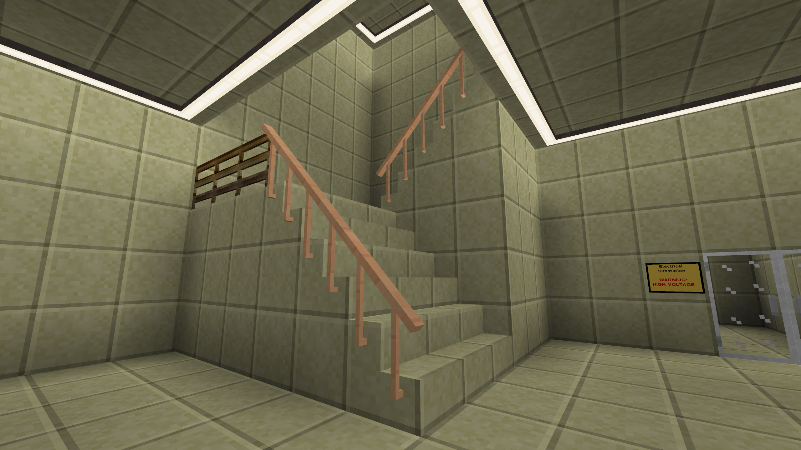

# banisters

Banisters mod for Minetest. Adds straight and diagonal banisters for stairs railings.

## How can be they crafted?
You can craft normal banisters simply by using this recipe:
```
[M] [M] [M]
[S] [ ] [S]
[ ] [ ] [ ]
```

Or you can craft a (little) more fancy one using this recipe:
```
[M] [M] [M]
[S] [S] [S]
[ ] [ ] [ ]
```

Where "M" is the material you want to use (wood, stone, etc) and "S" is `default:stick`.

## How to use them?
You can place them diagonally by pointing to a side of a stair or slope while facing slightly left or right. If you want to put a horizontal banister, just put it looking straight ahead to a wall or over the ground.



## Forum Topic
- not yet

## To do list
- Deprecate intllib if there will be more translations added.
- Add marmor and technic support (marble and granite textures).

## Changelog

### 0.2b
- Added more materials and craft recipes. Diagonal railings can be placed automatically depending on the facing direction.

### 0.14b
- Added more types and materials. Simplified register function.

### 0.12b
- Initial public release. Added basic wooden banisters.
